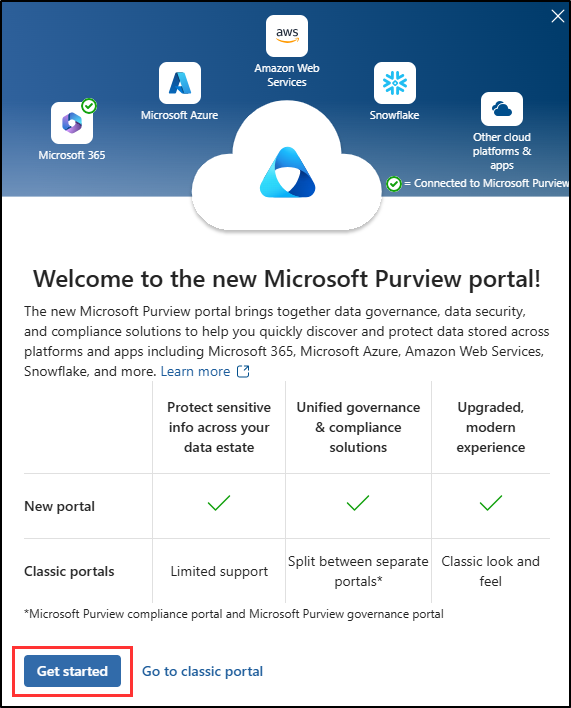

---
lab:
    task: 'Prepare your environment for administration'
    exercise: 'Exercise 0 - Prepare your environment for administration'
---

## WWL Tenants - Terms of use

If you are being provided with a tenant as a part of an instructor-led training delivery, please note that the tenant is made available for the purpose of supporting the hands-on labs in the instructor-led training.

Tenants should not be shared or used for purposes outside of hands-on labs. The tenant used in this course is a trial tenant and cannot be used or accessed after the class is over and are not eligible for extension.

Tenants must not be converted to a paid subscription. Tenants obtained as a part of this course remain the property of Microsoft Corporation and we reserve the right to obtain access and repossess at any time.

# Lab Setup: Preparing Your Environment for Administration

In this lab, you'll configure and prepare your environment for administration tasks. You'll activate necessary features, set up administrative permissions, and ensure proper configuration of key elements.

**Tasks:**

- Enable Audit in the Microsoft Purview portal
- Assign compliance roles
- Explore the Microsoft Purview portal

## Task – Enable Audit in the Microsoft Purview portal

In this task, you'll enable Audit in the Microsoft Purview portal to monitor portal activities. For the exercises in these labs, Audit is needed to create an auto-labeling policy.

1. In Microsoft Edge, navigate to the Microsoft Purview portal, `https://purview.microsoft.com`, and log in as a user with **Global Administrator** rights.

1. A message about the new Microsoft Purview portal will appear on the screen. Select the option to agree with the terms of data flow disclosure and the privacy statement, then select **Try now**.

    

1. Select **Solutions** from the left sidebar, then select **Audit**.

1. On the **Search** page, select the **Start recording user and admin activity** bar to enable audit logging.

    

1. Once you select this option, the blue bar should disappear from this page.

>[!alert] If you receive an error enabling Audit in this exercise, please use these steps as a work around:
>1. Open an elevated Terminal window by selecting the Windows button with the right mouse button and then select Terminal (Admin).
>1. Install the ExchangeOnlineManagement module by running `Connect-ExchangeOnline`
>1. Connect to the Exchange Online console by entering the administrator username and password from your lab hosting provider.
>1. To verify if Audit is enabled, run `Get-AdminAuditLogConfig | FL UnifiedAuditLogIngestionEnabled`
>1. If false, then the audit log is turned off.
>1. To enable Audit, run `Set-AdminAuditLogConfig -UnifiedAuditLogIngestionEnabled $true`
>   1. If you receive an error that you are unable to run the script in your orginization, run `Enable-OrganizationCustomization`
>   1. Try again to run `Set-AdminAuditLogConfig -UnifiedAuditLogIngestionEnabled $true`
>1. To confirm Audit is enabled, run `Get-AdminAuditLogConfig | FL UnifiedAuditLogIngestionEnabled`
>1. Once complete, run `Disconnect-ExchangeOnline` to end your session

You have successfully enabled auditing in Microsoft 365.

## Task – Assign compliance roles

In this task, you'll assign the **Compliance Admin** to the user you'll be using for these lab exercises.

1. Open **Microsoft Edge** and navigate to the Microsoft 365 admin center, `https://admin.microsoft.com`. You'll need to login as a user that has **Global Administrator** rights.

1. Expand **Users** in the left sidebar, then select **Active users**.

1. Select or create a user to continue with these lab exercises.

   If you choose to use an existing user, select a user with minimal rights for least access privilege.

   1. If creating a new user, assign the user with a license that's appropriate for these lab exercises. The user must have an Microsoft 365 E5 license or compatible add-on for these exercises. Assign the user the **Compliance Administrator** role in the optional settings in the new user set up and finalize your new user creation.

   1. If modifying the access of an existing user, select the user, then select **Manage roles**. Assign the user the **Compliance Administrator** role and save your changes.

1. Sign out of the account with the Global Administrator access by selecting their user icon in the top right, then select **Sign out**.

   Example:

   

You have successfully assigned a user the **Compliance Administrator** role, which is required to perform the different exercises of this lab.

## Task – Explore the Microsoft Purview portal

In this task, you'll sign in as the user you previously granted **Compliance Administrator** role to explore the Microsoft Purview portal. This role will be referred to as your **Compliance Administrator** in the next labs and exercises.

1. In **Microsoft Edge**, navigate to **`https://purview.microsoft.com`**.

1. When the **Pick an account** window is displayed, select **Use another account**.

1. When the **Sign in** window is displayed, sign in as the user you previous selected as the **Compliance Administrator**.

1. Get yourself familiar with the new Microsoft Purview Portal. When you are done, leave the browser window open.

You have successfully switched to the **Compliance Administrator**'s account and are now ready to start the lab.
