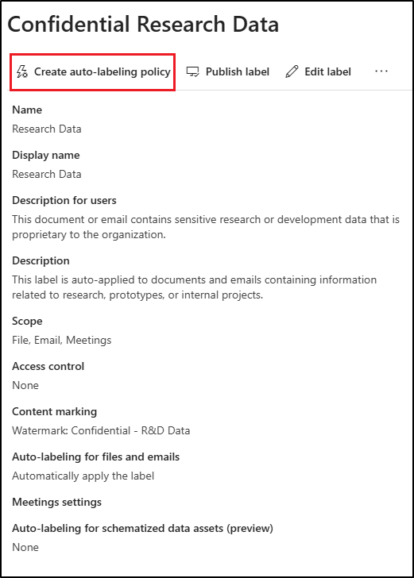
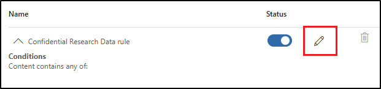

---
lab:
    task: 'Create and publish a sensitivity label'
    exercise: 'Exercise 2 - Create and publish a sensitivity label'
---

# Skilling Tasks

Your task is to create and publish sensitivity labels within your organization that classifies and protects sensitive data according to its level of confidentiality and the necessary access controls.

**Tasks**:

1. Enable support for sensitivity labels
1. Create sensitivity labels
1. Publish sensitivity labels
1. Configure auto labeling

## Task 1 – Enable support for sensitivity labels in SharePoint and OneDrive

In this task, you'll install the necessary modules and enable support for sensitivity labels on your tenant. This is needed for the optional task of applying sensitivity labels later in this exercise.

1. In the desktop, open an elevated PowerShell window by right clicking the Windows button in the task bar, then select **Terminal (Admin)**.

1. Confirm the **User Account Control** window with **Yes**.

1. Run the **Install-Module** cmdlet to install the latest Microsoft Graph PowerShell module version:

    ```powershell
    Install-Module -Name Microsoft.Graph -Scope CurrentUser
    ```
   > [!NOTE]
   > If you get a message stating that the module is already installed, run the following command instead:
    ```powershell
    Update-Module -Name Microsoft.Graph    ```
 
1. Confirm the Nuget security dialog and the Untrusted repository security dialog with **Y** for Yes and press Enter. This might take a while to complete processing.

1. Run the **Install-Module** cmdlet to install the latest SharePoint Online PowerShell module version:

    ```powershell
    Install-Module -Name Microsoft.Online.SharePoint.PowerShell
    ```

1. Confirm the Untrusted repository security dialog with **Y** for Yes and press Enter.

1. Run the **Connect-MgGraph** command to connect to the Microsoft Graph service:

    ```powershell
    Connect-MgGraph -Scopes "Domain.Read.All"
    ```

1. In the **Sign into your account** form, sign in as the user you selected as the **Compliance Administrator** in a previous exercise.

1. After signing in, navigate back to the terminal window.

1. Run the **Get-MgDomain** cmdlet and save the domain as a variable:

    ```powershell
    $domain = Get-MgDomain | Select-Object -Property ID
    ```

1. Use the _$domain_ variable created in the previous step to create a new variable for _$adminurl_:

    ```powershell
    $adminurl = "https://" + $domain.ID.split('.')[0] + "-admin.sharepoint.com"
    ```

1. Run the **Connect-SPOService** cmdlet using the _$adminurl_ variable created in the previous step:

    ```powershell
    Connect-SPOService -url $adminurl
    ```

1. In the **Sign into your account** form, sign in as the **Global Administrator**.

1. After signing in, navigate back to the terminal window.

1. Run the **Set-SPOTenant** cmdlet to enable support for sensitivity labels:

    ```powershell
    Set-SPOTenant -EnableAIPIntegration $true
    ```

1. Confirm the changes with **Y** for Yes and press Enter.

1. Close the PowerShell window.

You have successfully enabled support for sensitivity labels for Teams and SharePoint sites.

## Task 2 – Create sensitivity labels

In this task, your HR department has requested a sensitivity label to apply to HR employee documents. You'll create a sensitivity label for internal documents and a sublabel for the HR department.

1. Open **Microsoft Edge** and navigate to **`https://purview.microsoft.com`**. Log into Microsoft Purview as the user you selected as the **Compliance Administrator**.

1. In the Microsoft Purview portal, select **Solutions** from the left sidebar, then select **Information Protection**.

1. On the **Microsoft Information Protection** page, on the left sidebar, select **Sensitivity labels**.

1. On the **Sensitivity labels** page select **+ Create a label**.

1. The **New sensitivity label** configuration will start. On the **Provide basic details for this label**, enter:

    - **Name**: `Internal`
    - **Display name**: `Internal`
    - **Description for users**: `Internal sensitivity label.`
    - **Description for admins**: `Internal sensitivity label for Contoso.`

1. Select **Next**.

1. On the **Define the scope for this label** page, select **Items**, then select **Files** and **Emails**. If the checkbox for **Meetings** is selected, make sure it's deselected.

   > [!NOTE]
   > When **Meetings** is selected, you can't create a sublabel for the sensitivity label.

1. Select **Next**.

1. On the **Choose protection settings for labeled items** page, select **Next**.

1. On the **Auto-labeling for files and emails** page, select **Next**.

1. On the **Define protection settings for groups and sites** page, select **Next**.

1. On the **Auto-labeling for schematized data assets (preview)** page, select **Next**.

1. On the **Review your settings and finish** page, select **Create label**.

1. On the **Your sensitivity label was created** page, select **Don't create a policy yet**, then select **Done**.

1. On the **Sensitivity labels** page, find the newly created **Internal** sensitivity label. Select the vertical ellipsis (**...**) next to it, then select **+ Create sublabel** from the dropdown menu.

    

1. The **New sensitivity label** wizard will start. On the **Provide basic details for this label** page enter:

   - **Name**: `Employee data (HR)`
   - **Display name**: `Employee data (HR)`
   - **Description for users**: `This HR label is the default label for all specified documents in the HR Department.`
   - **Description for admins**: `This label was created with input from the Head of HR. Contact the HR department for any changes to the label settings.`

1. Select **Next**.

1. On the **Define the scope for this label** page, select **Items**, then select **Files**, **Emails**, and **Meetings**.

1. Select **Next**.

1. On the **Choose protection settings for labeled items** page, select the **Control access** option, then select **Next**.

1. On the **Access control** page, select **Configure access control settings**.

1. Configure the encryption settings with these options:

   - **Assign permissions now or let users decide?**: Assign permissions now
   - **User access to content expires**: Never
   - **Allow offline access**: Only for a number of days
   - **Users have offline access to the content for this many days**: 15
   - Select the **Assign permissions** link. On the **Assign permissions** flyout panel, select the **+ Add any authenticated users**, then select **Save** to apply this setting.

1. On the **Access control** page, select **Next**.

1. On the **Auto-labeling for files and emails** page, select **Next**.

1. On the **Define protection settings for groups and sites** page, select **Next**.

1. On the **Auto-labeling for schematized data assets (preview)** page, select **Next**.

1. On the **Review your settings and finish** page, select **Create label**.

1. On the **Your sensitivity label was created** page, select **Don't create a policy yet**, then select **Done**.

You have successfully created a sensitivity label for your organizations internal policies and a sensitivity sublabel for the Human Resources (HR) department.

## Task 3 – Publish sensitivity labels

You will now publish the Internal and HR sensitivity label so that the published sensitivity labels will be available for the HR users to apply to their HR documents.

1. In **Microsoft Edge**, the Microsoft Purview portal tab should still be open. If not, navigate to **`https://purview.microsoft.com`** > **Solutions** > **Information Protection** > **Sensitivity labels**.

1. On the **Sensitivity labels** page select **Publish labels**.

1. The publish sensitivity labels configuration will start.

1. On the **Choose sensitivity labels to publish** page, select the **Choose sensitivity labels to publish** link.

1. On the **Sensitivity labels to publish** flyout panel, select the **Internal** and **Internal/Employee Data (HR)** checkboxes, then select **Add** at the bottom of the flyout panel.

1. Back on the **Choose sensitivity labels to publish** page, select **Next**.

1. On the **Assign admin units** page, select **Next**

1. On the **Publish to users and groups** page, select **Next**.

1. On the **Policy settings** page, select **Next**.

1. On the **Default settings for documents** page, select **Next**.

1. On the **Default settings for emails** page, select **Next**.

1. On the **Default settings for meetings and calendar events** page, select **Next**.

1. On the **Default settings for Fabric and Power BI content** page, select **Next**.

1. On the **Name your policy** page, enter:

   - **Name**: `Internal HR employee data`
   - **Enter a description for your sensitivity label policy**: `This HR label is to be applied to internal HR employee data.`

1. Select **Next**.

1. On the **Review and finish** page, select **Submit**.

1. On the **New policy created**, select **Done** to finish publishing your label policy.

You have successfully published the Internal and HR sensitivity labels. Note that it can take up to 24 hours for changes to replicate to all users and services.

## Task 4 – Create a client-side auto labeling policy

In this task, you'll create a client-side auto-labeling policy. Client-side auto-labels apply automatically to files and emails based on their content, ensuring that sensitive information is classified and protected before it leaves the user's device.

1. You should still be on the **Sensitivity labels** page in the Microsoft Purview portal. If not, navigate to **`https://purview.microsoft.com`** > **Solutions** > **Information Protection** > **Sensitivity labels**.

1. On the **Sensitivity labels** page, find the newly created **Internal** sensitivity label. Select the vertical ellipsis (**...**) next to it, then select **+ Create sublabel** from the dropdown menu.

1. The **New sensitivity label** configuration will start. On the **Provide basic details for this label** page, enter:

   - **Name**: `Confidential Research Data`
   - **Display name**: `Confidential Research Data`
   - **Description for users**: `This document or email contains sensitive research or development data that is proprietary to the organization.`
   - **Description for admins**: `This label is auto-applied to documents and emails containing information related to research, prototypes, or internal projects.`

1. Select **Next**.

1. On the **Define the scope for this label** page, select **Items**, then select **Files**, **Emails**, and **Meetings**.

1. Select **Next**.

1. On the **Choose protection settings for labeled items** page, select **Apply content marking**, then select **Next**.

1. Select **Next**.

1. On the **Content marking** page, select the toggle to enable content marking.

1. If the checkbox for **Add a footer** is selected, deselect it, and select the checkbox for **Add a watermark**, then select **Customize text**.

1. In the **Customize watermark text** flyout pane, enter `Confidential - R&D Data` as **Watermark text**. Increase the **Font size** to `40`, then select **Save** at the bottom of the panel.

1. Back on the **Content marking** page, if other content marking options are enabled, disable them to ensure **Add a watermark** is the only option enabled.

1. Select **Next**.

1. On the **Auto-labeling for files and emails** page, set the **Auto-labeling for files and emails** to enabled.

1. In the **Detect content that matches these conditions** section, select **+ Add condition** > **Content contains**.

1. In **Content contains** section select the **Add** > **Trainable classifiers**.

1. In the **Trainable classifiers** flyout panel, add these trainable classifiers:

   - `Source code`
   - `Project documents`
   - `Software Product Development Files`

1. Select **Add** at the bottom of the panel to add these trainable classifiers.

1. Back on the **Auto-labeling for files and emails** page, select **Next**.

1. On the **Define protection settings for groups and sites** page, select **Next**.

1. On the **Auto-labeling for schematized data assets (preview)** page, select **Next**.

1. On the **Review your settings and finish** page, select **Create label**.

1. On the **Your sensitivity label was created** page, select **Publish label to users' apps**, then select **Done**.

1. On the **Publish label** flyout panel, select **Create new label policy**.

1. On the **Choose sensitivity labels to publish** page, select the **Choose sensitivity labels to publish** link.

1. Select the parent **Internal** label and the **Confidential Research Data** label that was just created, then select **Add**.

1. Back on the **Choose sensitivity labels to publish** page, select **Next**.

1. On the **Assign admin units** page, select **Next**.

1. On the **Publish to users and groups** page, select **Next**.

1. On the **Policy settings** page, select the checkbox for **Users must provide a justification to remove a label or lower its classification**, then select **Next**.

1. On the **Default settings for documents​** page, select **Next** until you reach the **Name your policy** page.

1. On the **Name your policy** page, enter:

   - **Name**: `R&D Confidential Data Policy`
   - **Enter a description for your sensitivity label policy**: `Automatically applies labels to source code, project documents, and development files to protect sensitive R&D data.`

1. Select **Next**.

1. On the **Review and finish** page, select **Submit**.

1. On the **New policy created** page, select **Done**.

You have successfully created a client-side auto-labeling policy that will automatically apply the **Confidential Research Data** label to files and emails containing research and development data. It might take up to 24 hours for the policy to take full effect.

## Task 5 – Create a service-side auto labeling policy

In this task, you'll create a service-side auto-labeling policy. Service-side auto-labels are applied by cloud services like SharePoint, Exchange, and OneDrive after content is uploaded or received, ensuring that sensitive data is protected even if users don't manually classify it.

1. You should still be on the **Sensitivity labels** page in the Microsoft Purview portal. If not, navigate to **`https://purview.microsoft.com`** > **Solutions** > **Information Protection** > **Sensitivity labels**.

1. Expand the **Internal** label, then select the `Confidential Research Data` sublabel you created in a previous task.

1. In the **Confidential Research Data** flyout panel, you'll see the properties for the auto-label you created in a previous task. In this panel, select **Create auto-labeling policy**.

    

1. On the **Name your policy** page, enter:

   - **Name**: `R&D Confidential Data Container Policy`
   - **Enter a description for your sensitivity label policy**: `Automatically applies the Confidential Research Data label to content in SharePoint, Exchange, and OneDrive.`

1. Select **Next**.

1. On the **Assign admin units** page, select **Next**.

1. On the **Choose locations where you want to apply the label** page, leave **Exchange email**, **SharePoint sites**, and **OneDrive accounts** selected, then select **Next**.

1. On the **Set up common or advanced rules** page, leave **Common rules** selected, then select **Next**.

1. On the **Define rules for content in all locations** page, edit the **Confidential Research Data rule**.

    

1. In the **New rule** flyout panel, under **Conditions** > **Content contains** select the dropdown for **Add**, then select **Trainable classifiers**.

1. In the **Trainable classifiers** flyout panel, add these trainable classifiers:

   - `Source code`
   - `Project documents`
   - `Software Product Development Files`

   This ensures consistent protection between client-side and service-side labels.

1. Select **Add** at the bottom of the panel to add these trainable classifiers.

1. Back on the **Define rules for content in all locations** page, select **Next**.

1. On the **Choose a label to auto-apply**, leave the **Internal/Confidential Research Data** chosen, then select **Next**.

1. On the **Decide if you want to test out the policy now or later** page, select **Run policy in simulation mode**, and select the checkbox for **Automatically turn on policy if not modified after 7 days in simulation**, then select **Next**.

1. On the **Review and finish** page, select **Create policy**.

1. On the **Your auto-labeling policy was created** page, select **Done**.

You have successfully created a service-side auto-labeling policy that will automatically apply the **Confidential Research Data** label to content stored or shared in SharePoint, Exchange, and OneDrive. It might take up to 24 hours for the policy to take effect.
